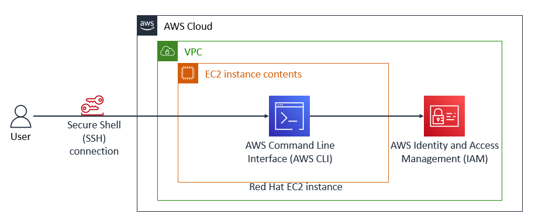

# How Install and Configure the AWS CLI

### Lab overview
The AWS Command Line Interface (AWS CLI) is a command line tool that provides an interface for interacting with products and services from Amazon Web Services (AWS).

You can install the AWS CLI on your local machine or a virtual machine such as an Amazon Elastic Compute Cloud (Amazon EC2) instance.

In this activity, you install and configure the AWS CLI on a Red Hat Linux instance because this instance type does not have the AWS CLI pre-installed. Some instance types, such as Amazon Linux, do come pre-installed with the AWS CLI. 

During this activity, you establish a Secure Shell (SSH) connection to the instance. You configure the installation with an access key that can connect to an AWS account. Finally, you practice using the AWS CLI to interact with AWS Identity and Access Management (IAM).

When you finish the activity, it will reflect the following diagram:


_In the preceding diagram, you can access the AWS Cloud through an SSH connection. Within the AWS Cloud, a virtual private cloud (VPC) with a Red Hat EC2 instance is configured with the AWS CLI. IAM is configured, and you use the AWS CLI to interact with IAM._

## Objectives

1. Install and configure the AWS CLI.

1. Connect the AWS CLI to an AWS account.

1. Access IAM by using the AWS CLI.

## Accessing the AWS Management Console
Based on the task given, a lab was provided.

# Connect to the Red Hat EC2 instance by using SSH 

_In this task, an EC2 instance was already in existence._

As a Windows user, **PuTTy** was recommended for usage.<br>
_PuTTY is an SSH and telnet client, developed originally by Simon Tatham for the Windows platform._

* Download PuTTY to use an SSH utility to connect to the EC2 instance. If you do not have PuTTY installed on your computer, [download it](https://www.chiark.greenend.org.uk/~sgtatham/putty/latest.html).

- A private key **(.ppk format)** was provided based on the already existing EC2 instance created.


 
- A Public IP was provided based on the already existing EC2 instance created.


- After downloading **PuTTY**, Open **PuTTy.exe**

- Configure the PuTTY timeout to keep the PuTTY session open for a longer period of time:
  * Choose Connection.
  * For Seconds between keepalives, enter 30.

  
  
  <br>

- Configure your PuTTY session:

  * Choose Session.
  * For the Host Name (or IP address), enter the PublicIP address that you copied from the previous steps.


 

<Br>

* In PuTTY in the Connection list, choose SSH to expand it.
* Choose Auth, then choose Credientials
* Choose Browse.
* Browse to and select the **Private key** file that you downloaded.
* To choose the file, choose Open.
* Choose Open again.


- Finally, click Open.

- When prompted with login as, enter ec2-user and press Enter.
_This step connects you to the EC2 instance._


# Install the AWS CLI on a Red Hat Linux instance

### From terminal window to install the AWS CLI on a Red Hat Linux instance.

1. To write the downloaded file to the current directory, run the following curl command with the -o option:

```
curl "https://awscli.amazonaws.com/awscli-exe-linux-x86_64.zip" -o "awscliv2.zip"
```

2. To unzip the installer, run the following unzip command with the -u option. In this command, the unzip command prompts you to overwrite any existing files. To skip these prompts, the command includes the -u option.

```
unzip -u awscliv2.zip
```

3. To run the install program, run the following command. This sudo command grants write permissions to the directory. The installation command in the code snippet uses a file named install in the unzipped aws directory to install the AWS CLI. 

```
sudo ./aws/install
```

4. To confirm the installation, run the following command:
```
aws --version
```

5. The following is an example of the output:
```
aws-cli/2.13.35 Python/3.11.6 Linux/4.14.327-246.539.amzn2.x86_64  exe/x86_64.amzn.2 prompt/off
```
_Note: The version numbers that are installed change overtime and might not reflect this example._

6. To verify that the AWS CLI is now working, run the following aws help command. The help command displays the information for the AWS CLI.
```
aws help
```
7. At the : prompt, enter q to exit.


<br>

# Configure the AWS CLI to connect to your AWS Account

- In the SSH session terminal window, run the configure command for the AWS CLI:
```
aws configure
```

- At the prompt, configure the following:<br>
_The following below was provided as a result of the existing Ec2 instance._
  * **AWS Access Key ID:**  Copy and paste the AccessKey value into the terminal window. 

  * **AWS Secret Access Key:** Copy and paste the SecretKey value into the terminal window.

  * **Default region name:** Enter us-west-2

  * **Default output format:** Enter json

  

  <br>

- In the terminal window, test the IAM configuration by running the following command:
```
aws iam list-users
```
 

### _Fellow me for more practical steps_

